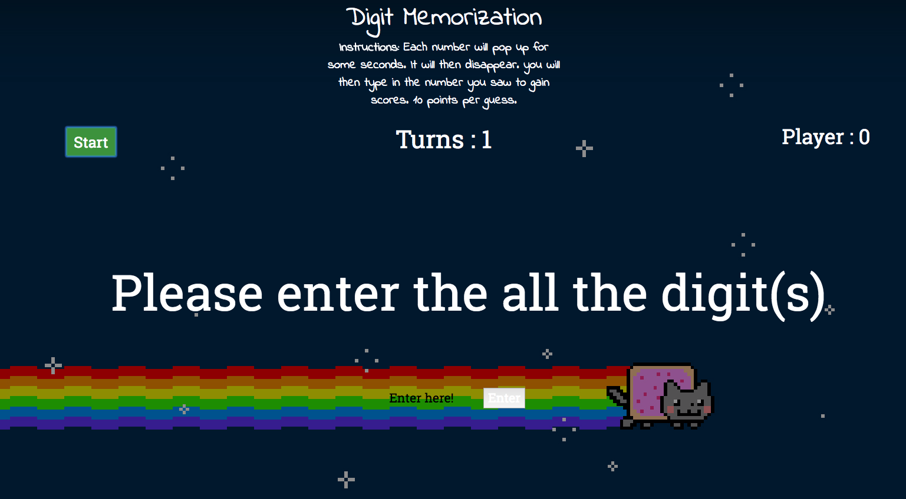

# [Digit Memorization](https://digit-memorization.herokuapp.com/)
HELLO. This is my first ever project on a webgame. This game is targetted for people that can click a mouse button, type in numbers and remember a string of numbers. The amount of digits will be according to however many turns you have played. If you have answered correctly, a digit will be added to the number string and your score will go up by 1! However if you get it incorrectly, the opposite will happen!

I used HTML, CSS, and Javascript/jQuery to make the game. The game just pops up numbers for users to remember. Everytime the user press play, it adds a digit and it gets harder and harder up until you don't want to play anymore :)

## Installation
Please just Fork this folder and clone it then open up the index.html and press start!!
